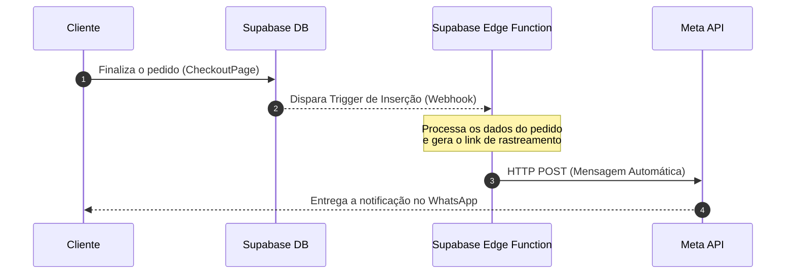

# Plano de Projeto: Notificações Automáticas via WhatsApp Cloud API (Meta) 🍪📱

Este documento detalha o planejamento para integrar as notificações de rastreamento da **Sr. Cookies** de forma 100% automatizada e sem qualquer custo de hospedagem, utilizando a **API oficial da Meta (WhatsApp Cloud API)** e **Supabase Edge Functions**.

---

## 🎨 Visão Geral do Fluxo Sem Hospedagem



---

## 🎯 Success Criteria

1. **Automação Completa:** Envio imediato da notificação sem dependência do navegador do cliente ou intervenção do lojista.
2. **Hospedagem Zero:** Utilização do Supabase Edge Functions (gratuito) para eliminar a necessidade de manter servidores ativos.
3. **Custo Zero de Disparos:** Enquadramento na faixa gratuita da Meta de **1.000 conversas mensais gratuitas**.
4. **Segurança de Tokens:** Armazenamento seguro de chaves de API nos segredos (`Secrets`) do Supabase.

---

## 🛠️ Fase 1: Configuração do Painel da Meta (WhatsApp Cloud API)

### 1. Criar Conta e App
- Acessar o [Meta for Developers](https://developers.facebook.com/) e criar uma conta.
- Clicar em **Criar Aplicativo** ➡️ Selecionar a opção **Outro** ➡️ Escolher o tipo **Empresa**.
- Adicionar o produto **WhatsApp** ao aplicativo.

### 2. Configurar Número de Teste
- No menu do WhatsApp, acessar **Configuração de API**.
- Copiar o **Token de Acesso Temporário** e o **ID do Número de Telefone**.
- Cadastrar o seu número pessoal em "Adicionar Número de Telefone para Teste" para autorizar o recebimento de mensagens durante a fase de testes.

### 3. Cadastrar Número Real (Produção)
- Adquirir um chip de telefone extra e exclusivo para o robô.
- No painel da Meta, clicar em **Add Phone Number** no gerenciador de negócios.
- Confirmar o número inserindo o código de 6 dígitos enviado por SMS.

### 4. Cadastrar Template de Mensagem
- Acessar o Gerenciador de WhatsApp da Meta ➡️ Modelos de Mensagem.
- Criar um modelo da categoria **Utilidade** chamado `confirmacao_pedido`:
  - **Texto do Corpo:** `Olá {{1}}! Seu pedido foi confirmado e já está sendo preparado com muito carinho. Acompanhe a entrega em tempo real direto no mapa pelo link: {{2}}`
- Submeter para aprovação (o robô da Meta aprova em menos de 5 minutos).

---

## 🛠️ Fase 2: Implementação da Supabase Edge Function

### 1. Criar a Função `send-tracking-whatsapp`
Desenvolver uma Edge Function em TypeScript dentro da estrutura do Supabase:

```typescript
// supabase/functions/send-tracking-whatsapp/index.ts
import { serve } from "https://deno.land/std@0.168.0/http/server.ts"

const META_ACCESS_TOKEN = Deno.env.get("META_ACCESS_TOKEN")
const META_PHONE_NUMBER_ID = Deno.env.get("META_PHONE_NUMBER_ID")

serve(async (req) => {
  try {
    const payload = await req.json()
    const { record } = payload // Dados do pedido inseridos na tabela `orders`
    
    const shippingAddr = record.shipping_address
    const customerPhone = shippingAddr?.phone?.replace(/\D/g, "")
    const customerName = record.customer_name || "Cliente"
    const orderId = record.id
    
    if (!customerPhone) {
      return new Response("Nenhum celular cadastrado para envio.", { status: 200 })
    }

    const trackingUrl = `https://srcookies.com/track/${orderId}`
    const cleanPhone = `55${customerPhone}` // Padrão internacional do Brasil

    // Envio HTTP POST para a API oficial da Meta
    const res = await fetch(`https://graph.facebook.com/v20.0/${META_PHONE_NUMBER_ID}/messages`, {
      method: "POST",
      headers: {
        "Authorization": `Bearer ${META_ACCESS_TOKEN}`,
        "Content-Type": "application/json"
      },
      body: JSON.stringify({
        messaging_product: "whatsapp",
        to: cleanPhone,
        type: "template",
        template: {
          name: "confirmacao_pedido",
          language: { code: "pt_BR" },
          components: [
            {
              type: "body",
              parameters: [
                { type: "text", text: customerName },
                { type: "text", text: trackingUrl }
              ]
            }
          ]
        }
      })
    })

    const data = await res.json()
    return new Response(JSON.stringify(data), { status: 200 })
  } catch (err) {
    return new Response(JSON.stringify({ error: err.message }), { status: 500 })
  }
})
```

---

## 🛠️ Fase 3: Configurar Trigger de Banco de Dados

### 1. Criar o Webhook no Supabase Dashboard
- Ir em **Database ➡️ Webhooks ➡️ Create Webhook**.
- **Nome:** `trigger_send_whatsapp_on_new_order`
- **Tabela:** `public.orders`
- **Eventos:** `INSERT` (apenas quando um pedido for criado).
- **Tipo de Destino:** `HTTP Webhook`.
- **Método HTTP:** `POST`.
- **URL de Destino:** Escolha a URL da Edge Function recém-criada (ex: `https://[seu-projeto].supabase.co/functions/v1/send-tracking-whatsapp`).
- **Segurança:** Adicione o header de autorização bearer secreto da Edge Function.

---

## 🧪 Fase de Verificação (PHASE X)

- [ ] Cadastrar conta no Meta Developers e habilitar o WhatsApp.
- [ ] Validar o envio manual de mensagem de teste para o número autorizado.
- [ ] Implantar a Supabase Edge Function com `supabase functions deploy send-tracking-whatsapp`.
- [ ] Configurar as variáveis de ambiente `META_ACCESS_TOKEN` e `META_PHONE_NUMBER_ID` no Supabase CLI/Dashboard.
- [ ] Realizar um pedido de teste no Checkout do site e confirmar se a trigger ativou com sucesso.
- [ ] Verificar o recebimento automático da mensagem no WhatsApp do cliente com o link de rastreamento.
